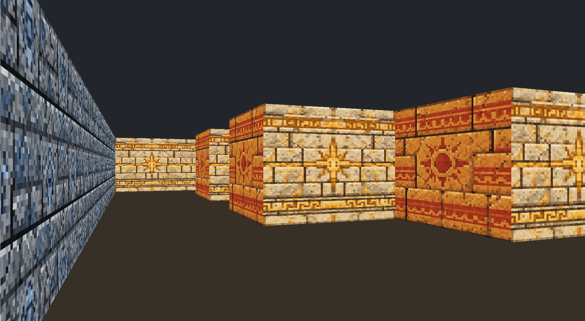

# cub3D

A small raycasting engine written in **C**, developed as part of the 42 curriculum and inspired by the software-rendering techniques used by early first-person games such as **Wolfenstein 3D**.

The project turns a validated 2D map into a pseudo-3D first-person view by casting one ray per vertical screen column, finding the first wall hit, projecting that wall slice according to its distance, and sampling the correct texture.

> This was a collaborative 42 project.

## Screenshot

<p align="center">
  
</p>

The project was intentionally kept visually simple. Our priority was not to build a feature-rich game, but to reproduce and understand the **raycasting pipeline itself**: how a 2D grid, a player position and a camera plane can be transformed into a navigable pseudo-3D view without relying on a modern 3D engine.

## Highlights

- DDA-style raycasting
- One ray projected for each vertical screen column
- Distance-based wall projection
- Direction-dependent wall textures
- XPM texture sampling
- Configurable floor and ceiling colors
- Player movement, strafing and rotation
- Collision checking
- `.cub` configuration parsing
- Map validation and closed-map detection
- MiniLibX rendering on Linux
- Explicit resource cleanup and error handling

## How the renderer works

The map remains fundamentally **2D**. Walls are cells in a grid and the player is represented by a position, a direction vector and a camera plane.

For every vertical column of the screen:

1. the engine converts the screen column into a camera-space coordinate;
2. a ray direction is calculated from the player's direction and camera plane;
3. the ray starts in the player's current map cell;
4. `delta_dist_x` and `delta_dist_y` describe how far the ray must travel to cross one grid boundary on each axis;
5. the **DDA traversal** advances from cell to cell by choosing the nearest next X or Y boundary;
6. traversal stops when the ray reaches a wall cell;
7. the perpendicular wall distance is calculated;
8. that distance determines the height of the wall slice projected on screen;
9. the exact hit position on the wall determines the texture X coordinate;
10. pixels are sampled vertically from the appropriate North, South, East or West texture.

The result is a convincing first-person perspective even though the world itself is still represented as a 2D grid.

### DDA traversal

The central part of the renderer is the grid traversal in `perform_dda()`.

Instead of advancing a ray in tiny arbitrary increments, the algorithm jumps directly from one grid boundary to the next. At each step it compares the next horizontal and vertical intersection distances, advances along the closest one, and checks the newly entered map cell for a wall.

This is both simpler and more efficient than repeatedly sampling points along the ray.

### Projection and textures

Once a wall is hit, the engine calculates its perpendicular distance from the player and derives the projected line height:

```text
line_height = screen_height / wall_distance
```

The intersection position is then reduced to a coordinate inside the wall tile and used to sample a 64×64 XPM texture.

The side of the wall and the direction of the ray select one of the four textures:

```text
North · South · East · West
```

Texture coordinates are mirrored when necessary so that opposite-facing walls remain visually coherent.

## Parsing and world setup

Before rendering starts, the `.cub` file is parsed and validated.

The project checks, among other things:

- the four texture paths;
- floor and ceiling RGB values;
- the map contents and allowed characters;
- the player position and orientation;
- duplicate or missing configuration entries;
- whether the map is fully enclosed.

Only after this validation does the program initialize the player, load the textures and start the rendering loop.

## Movement and rendering loop

Keyboard events update movement and rotation state. Movement is validated against the map before changing the player's position, which prevents walking through walls.

Each rendered frame then rebuilds the screen from the current player position:

```text
player / camera
      ↓
ray per screen column
      ↓
DDA grid traversal
      ↓
wall distance
      ↓
projected wall slice
      ↓
texture sampling
      ↓
MiniLibX image
```

## Why keep it simple?

The simplicity is deliberate.

The most interesting part of cub3D is not adding weapons, enemies, complex levels or modern rendering effects. It is understanding how early software renderers could create the illusion of a 3D environment from limited hardware and a comparatively small set of mathematical ideas.

That constraint makes the rendering process visible: projection, grid traversal, texture coordinates, collision logic and the relationship between the 2D map and the final image all remain close to the code.

## Build

The current Makefile is configured for Linux and MiniLibX.

```bash
make
```

Run the program with a map:

```bash
./cub3D maps/<map>.cub
```

## Controls

| Key | Action |
| --- | --- |
| `W` | Move forward |
| `S` | Move backward |
| `A` | Strafe left |
| `D` | Strafe right |
| `←` / `→` | Rotate |
| `Esc` | Quit |

## What this project demonstrates

cub3D brings together geometry, low-level graphics, parsing, memory management, collision handling and an event-driven rendering loop.

More importantly, it makes the rendering pipeline tangible: a mathematical ray leaves the player, traverses a 2D grid, hits a wall, becomes a projected vertical slice and finally turns into textured pixels on screen.

---

Part of my developer portfolio: **[github.com/Overflow-ADW](https://github.com/Overflow-ADW)**  
Professional work: **[Avenue du Web](https://avenueduweb.be)**
